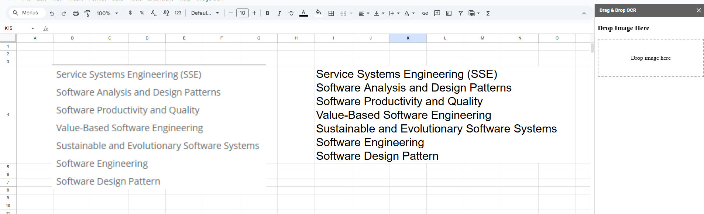

# Google Sheets Image OCR with Drag & Drop

This project allows you to drag and drop an image into a Google Sheets sidebar, automatically upload it to Google Drive, and extract text using the Google Cloud Vision API.

## Features
- Drag and drop image upload
- Uploads to Google Drive
- Extracts text from images via OCR
- Pastes text into the selected cell in your sheet

## Setup
1. Create a Google Cloud project and enable the Vision API
2. Get your API key
3. Paste `Code.gs` and `UploadSidebar.html` into Apps Script editor
4. Replace `YOUR_API_KEY_HERE` with your key
5. Reload the Sheet and open the sidebar from the custom menu

